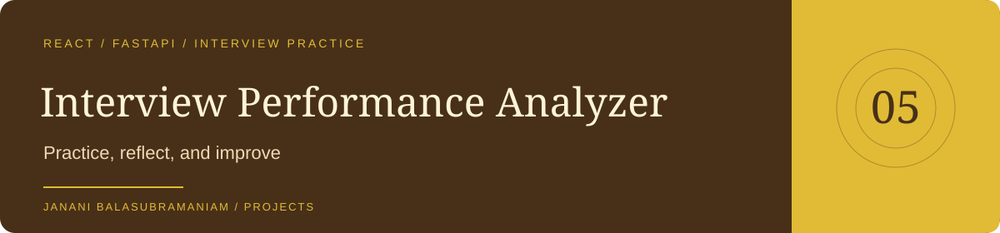

<p align="center"></p>

<p align="center"><a href="https://github.com/Janani-Balasubramanian">GitHub profile</a> · <a href="https://github.com/Janani-Balasubramanian/portfolio">Portfolio</a> · <a href="https://github.com/Janani-Balasubramanian/ai.Interviewer_analyser/issues">Issues</a></p>

# Interview Performance Analyzer

A full-stack mock-interview practice MVP with account access, domain tracks, experience tiers, interview reports, progress history, and a credit-based practice flow.

## Project at a glance

| Layer | Implementation |
| --- | --- |
| Frontend | React, TypeScript, Vite, React Router |
| Backend | FastAPI, SQLAlchemy, Pydantic |
| Scoring | Mock scoring by default, with optional LLM scoring |
| Main screens | Login, registration, dashboard, interview, report |

## Scoring behavior

The default scorer uses answer-length heuristics and randomized values. Optional LLM scoring is implemented in `backend/app/services/scoring.py`; it falls back to mock scoring when the provider call fails. Treat reports as practice feedback, not a validated assessment of ability or suitability for employment.

## Start locally

Use the backend and frontend instructions in the preserved guide below. The frontend's declared dependencies already include Axios and React Router, so a separate installation of those packages is unnecessary after installing the manifest.

---

## Detailed project guide

# AI-Based Interview Performance Analyzer

Full-stack MVP for practicing mock interviews with AI scoring, free-tier limits, gamified credit system, experience tiers, and domain tracks.

## Features Implemented

- User registration / login (JWT)
- Experience tiers (Tier 1 / 2 / 3)
- Domain tracks (Software Engineering, Data Analytics, HR, Business Analytics, Product Management, Marketing)
- Free tier: 4 interviews/month
- Gamified scoring: accumulate >250 points to unlock 5th bonus interview
- Mock AI scoring (switch to real OpenAI by setting API key)
- Dashboard with progress, credits, history
- Interview flow + detailed report

## Project Structure

```
interview-analyzer/
├── backend/                 # FastAPI
│   ├── app/
│   │   ├── core/            # config, database, security
│   │   ├── models/          # SQLAlchemy + Pydantic
│   │   ├── routers/         # auth, interviews, dashboard
│   │   ├── services/        # scoring, credits
│   │   └── main.py
│   └── requirements.txt
└── frontend/                # React + Vite + TypeScript
    └── src/
        ├── pages/           # Login, Register, Dashboard, Interview, Report
        ├── components/
        └── api.ts
```

## Quick Start (Local)

### 1. Backend

```bash
cd backend
python -m venv venv
source venv/bin/activate          # Windows: venv\Scripts\activate
pip install -r requirements.txt

# Optional: create .env
cp .env.example .env

# Run
uvicorn app.main:app --reload --host 0.0.0.0 --port 8000
```

API docs: http://localhost:8000/docs

### 2. Frontend

```bash
cd frontend
npm install
npm install react-router-dom axios   # if not already installed

# Optional: set API URL
# Create .env → VITE_API_URL=http://localhost:8000/api/v1

npm run dev
```

Open http://localhost:5173

### 3. Test Flow

1. Register a new account (choose experience tier)
2. On dashboard, select a domain and start interview
3. Answer 5 questions (type answers)
4. Finish → view report
5. Scores accumulate toward the 250-point bonus unlock

## Switching to Real AI Scoring

In `backend/.env` (or environment):

```
OPENAI_API_KEY=sk-...
USE_MOCK_AI=false
```

Restart the backend. The scoring service will call GPT-4o-mini with structured rubrics.

## Deployment Recommendations

### Recommended Stack (Simple & Cheap)

| Component     | Platform              | Notes |
|---------------|-----------------------|-------|
| Frontend      | **Vercel**            | Free tier, automatic deploys from Git |
| Backend       | **Railway** or **Render** | Easy Docker / native Python deploy |
| Database      | **Railway Postgres** or **Supabase** / **Neon** | Free tiers available |
| File Storage  | Cloudflare R2 or S3   | For future audio/video |

### Alternative All-in-One

- **Railway**: Deploy both frontend + backend + Postgres in one project
- **Fly.io**: Great for global low-latency
- **AWS / GCP / Azure**: For production scale later

### Frontend Deploy (Vercel)

1. Push repo to GitHub
2. Import project in Vercel → select `frontend` folder
3. Set environment variable: `VITE_API_URL=https://your-backend.up.railway.app/api/v1`
4. Deploy

### Backend Deploy (Railway)

1. Create new project → Deploy from GitHub (select `backend` folder)
2. Add environment variables:
   - `SECRET_KEY` = long random string
   - `DATABASE_URL` = Railway Postgres connection string
   - `OPENAI_API_KEY` (optional)
   - `USE_MOCK_AI=true` (or false)
3. Start command: `uvicorn app.main:app --host 0.0.0.0 --port $PORT`
4. Enable public networking

### Production Checklist

- [ ] Change `SECRET_KEY`
- [ ] Use PostgreSQL instead of SQLite
- [ ] Restrict CORS origins
- [ ] Add rate limiting
- [ ] Set up HTTPS (automatic on Vercel/Railway)
- [ ] Configure proper logging & monitoring
- [ ] Add audio recording (MediaRecorder API) + Whisper transcription for real voice interviews

## Extending the Project

- Add voice recording + Whisper transcription
- Expand question bank per domain/tier
- Real LLM judge with better rubrics
- Stripe subscriptions for unlimited interviews
- Peer comparison / leaderboards
- Company-specific interview packs

---

Built as a complete, runnable MVP matching the original product plan.
